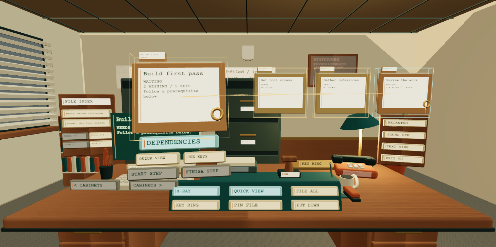
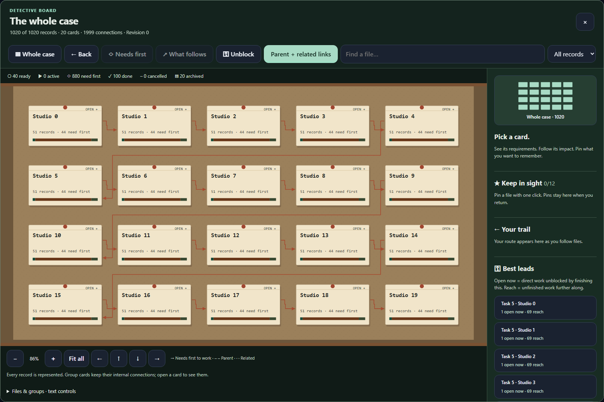
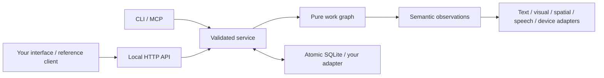

# StateWork

**A local work organizer. A backend for any way of working.**

StateWork gives tasks, projects, notes, events and their relationships a shared meaning, independent of how they are presented. Use the included list, board, timeline, relationship map, focus or text view. Build your own interface with the same commands, permissions, observations and history.

Inspired by the engine-first architecture of StateBeats in `3dRythm`. The backend is the product; the reference client demonstrates ways through it.

**0.1.0 developer foundation.** Personal-first and local-only. No accounts, cloud, telemetry, subscription, external API or AI model is needed. See [verified behavior and limits](docs/ACCEPTANCE.md).

## Start here

Use Node **24.13+ in the 24.x line** (recommended), or Node 25. The SQLite module may print an experimental warning on these runtimes.

```sh
npm ci
npm run build
npm start
```

Open **[127.0.0.1:4180](http://127.0.0.1:4180)**. The browser connects to the local service automatically. An original example workspace helps you explore; choose **New workspace** for your own work. Set `STATEWORK_DEMO=0` before the first start to omit the example.

Prefer working in 3D? Open **[StateWork Office](http://127.0.0.1:4180/spatial/)** and fill in a project. Work at a furnished 1980s desk: open filing cabinets, hold folders, earn prerequisite keys, reveal dependencies with X-ray and bring related files into Quick View. The telephone brings your next step; the stamp records completion. Desktop, phone and VR controls share the same work and history. **Local PC VR developer preview; tested with Quest runtime emulation, physical headset validation pending.** [Setup, controls and extension guide](docs/SPATIAL.md).



The **Detective board** connects the complete workspace on the right wall. Open project groups, follow requirements or downstream work, and keep persistent pins beside your investigation. **Unblock** shows which prerequisites open work now and which reach further. The full-screen board adds search, zoom, pan and text controls. Walk with **WASD / controller thumbsticks**, or use one-click desk and board stations. [Board and room guide](docs/DETECTIVE_BOARD.md).



The **wall calendar** gives each day an ordered recommendation plan, even without deadlines. Start with four focused hours on weekdays; shorten today with one click. Prerequisites come first, real appointments stay fixed, and completed work stays recorded. Month/week views, resource links and file actions work on screen and in the room. Developers can reuse the read-only planner through core, SDK or HTTP. [Calendar and planner guide](docs/CALENDAR.md).


**Work packets** turn a focused task into a visual step-by-step route with exact actions, required access/materials, result checks, recovery instructions and cited source captures. Follow on screen or in the VR room, then print the complete instructions and references. The manual workflow needs no AI; optional local Codex sign-in can prepare a draft for review. Changed requirements and missing evidence block approval. [Work packet and integration guide](docs/WORK_PACKETS.md).

Capture something with **Add work**. Open it to edit its status, notes, tags, dates, effort or schedule. Link prerequisites and navigate directly between related work. **Next actions** shows unfinished tasks whose prerequisites are clear. **Archive** keeps work and its connections available for restoration. **Save view** preserves the current query and presentation.

Reading & interaction offers text size, contrast, detail, motion, page size and time zone settings. Everything is reachable through standard keyboard controls. Text view offers plain text and on-demand local browser speech when a local voice exists. Focus view offers one actionable task at a time. There is no mandatory spatial, audio, color-only, drag or timed interaction.

Data lives in `.statework/` under your working directory. `STATEWORK_HOME` selects another directory. `STATEWORK_PORT` selects another loopback port. Keep that directory private; it is already ignored by Git. Closing the browser does not erase your work. Restart the service to return to it.

## Build your layer

```js
import { MemoryStore, WorkService } from '@statework/sdk';

const service = new WorkService(new MemoryStore());
const work = service.connect('me'); // trusted host binds identity
work.create({ id: 'personal', title: 'My work' });

work.execute('personal', {
  schemaVersion: 1,
  requestId: 'capture-1',
  expectedRevision: 0,
  commands: [
    {
      type: 'item.create',
      item: { id: 'draft', kind: 'task', title: 'Write a first draft', status: 'ready' },
    },
  ],
});

const observation = work.observe('personal', { query: { actionable: true } });
console.log(observation.nodes[0]); // label, summary, facts, relationships, actions, navigation
service.close();
```

Exact retries return the original result. A changed workspace produces a conflict rather than overwriting another writer. A batch either commits all commands, the event and its retry receipt, or none of them. Observing never changes work.

The packages are **not published to npm**. These imports work in the checkout. `npm run release:local` creates local package tarballs and tests them together in a fresh installation.

| Package                | Responsibility                                                                                                        |
| ---------------------- | --------------------------------------------------------------------------------------------------------------------- |
| `@statework/core`      | Dependency-free model, deterministic transitions, graph invariants, queries, semantic observations, daily planning                    |
| `@statework/sdk`       | Runtime validation, trusted connection service, storage contract, memory adapter, perception negotiation, HTTP client |
| `@statework/node`      | Transactional SQLite adapter, local credentials, database backups, original example data                              |
| `@statework/server`    | Loopback HTTP API, same-origin browser bootstrap, OpenAPI and reference client hosting                                |
| `@statework/tools`     | CLI and real stdio MCP server using the shared service                                                                |
| `@statework/reference` | Six browser views plus the Spatial/WebXR layer, fill-in setup, editing and quick navigation                           |



Start with [a complete headless loop](examples/headless.mjs), [perception adapters and fallback](examples/perception.mjs), or [the HTTP client](examples/http.mjs).

```sh
npm run demo
node examples/perception.mjs
npm run cli -- create personal "My work"
npm run cli -- command personal examples/create-task.json
npm run cli -- observe personal
```

- [Choose a starting point for your own layer](docs/BUILD_ON_TOP.md)
- [Architecture, invariants and extension seams](docs/ARCHITECTURE.md)
- [SDK and API contract](docs/API.md)
- [Perception and interaction contract](docs/PERCEPTION.md)
- [Spatial / VR setup and developer guide](docs/SPATIAL.md)
- [CLI and MCP integration](docs/TOOLS.md)
- [Data ownership, export and full backup](docs/DATA.md)
- [Acceptance evidence and current limits](docs/ACCEPTANCE.md)
- [Contributing](CONTRIBUTING.md), [security boundary](SECURITY.md), [changelog](CHANGELOG.md)

## Verify and package

```sh
npm run check
npx playwright install chromium firefox webkit
npm run test:e2e
npm run release:local
```

Source: [RONITERVO/StateWork](https://github.com/RONITERVO/StateWork). The CI workflow covers Windows, Linux and macOS. Local evidence is recorded separately from hosted CI results. Development and release scripts publish nothing; npm packages remain unpublished. See [the release guide](docs/RELEASE.md) for packaging and publication details.

Code and original sample data are [MIT licensed](LICENSE). Dependency licenses are recorded in [THIRD_PARTY_NOTICES.md](THIRD_PARTY_NOTICES.md).
