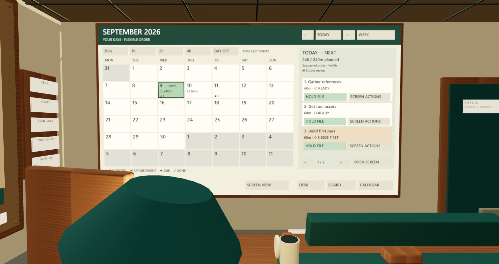

# Wall calendar and daily direction

Open **Calendar** for the screen view, or **Calendar on wall** to face the large rear-wall calendar. The telephone and morning card bring the first ready task in today's plan. There is no need to invent deadlines.



## A useful morning

1. **Today** shows an ordered plan. The default is **4 focused hours, Monday–Friday**.
2. Starting late? Pick **30m, 1h, 2h, 4h left**, or **Day off**. This changes the remaining allowance today, not a deadline.
3. **Hold file** brings the real folder into your hand. **Open file** shows its requirements, notes and source. **Start**, **worked**, and **Finish** use the normal saved command pipeline.
4. **Tomorrow**, **Next week**, or **Do next** change a private preference. Choosing dependent work also prioritizes its prerequisites, while respecting their defer dates.
5. **My week** changes the default hours and working days. Preferences are separate for each workspace in this browser.

**○ Suggestions**, **▣ appointments**, **◆ deadlines**, and **✓ recorded completion** have different shapes and labels. The month shows context; Week narrows it. Select a date for that day's actions. Arrow keys move between day buttons, Escape returns to the opening control. The screen view works on a phone and without WebGL. In VR, controller rays operate the calendar and pick up files; **Screen actions** exits VR for browser work controls.

## What the recommendations mean

The pure planner uses actual dependency edges, estimates, priority, ongoing work, due dates, fixed schedules and available capacity. Unfinished non-task prerequisites need explicit completion; archived unfinished prerequisites remain blocking. Cancelled prerequisites are treated as waived, consistent with the rest of StateWork.

Among available tasks, order follows your chosen task/prerequisite chain, urgent deadlines (today/overdue, then the coming week), active work, inherited priority, direct dependent count, due date, creation instant and stable ID. Consumer urgency moves upstream. A projected prerequisite finish may make a later recommendation possible; **After prerequisites** identifies that assumption. It never grants permission to start or complete blocked work.

Tasks split into blocks of at most 60 minutes. Missing or exhausted estimates receive an **≈30m review block**, not an invented completion record. **+ Xm worked** explicitly records that amount and reduces a known remaining estimate. **Finish** remains an explicit action. These actions can also be taken ahead of a suggested date; the label always says minutes worked and records today.

Fixed intervals reserve availability and remain unchanged. Four hours means flexible focus time outside those intervals, with no invented working-hour range. Starting near midnight caps the plan by the time actually left in the local date. Overlapping appointments are counted once when finding free time and are flagged. Past unfinished appointments or prerequisite timing conflicts appear in **Needs review**. Edit actual schedules in Classic views.

The office projects 90 days; the core defaults to 42 and supports 1–90. Each day returns at most 100 blocks and explicitly reports when that bound is reached. Unplaced and partly projected tasks remain in **Needs review**, with pages covering every result. Month navigation outside the forecast shows actual records and says the forecast is unavailable. Finished and archived records remain in the work graph and history; a ✓ on a date refers to a finished record with an actual scheduled interval, not a guessed completion date.

Finishing an allocation reserves its share of today's allowance so the app does not refill the day endlessly. That reservation is only a browser planning preference. **Only explicitly logged minutes are work-time records.** Undo/reopen restores the allowance, and the daily reservation resets on the next local date. Unknown or exhausted-estimate review blocks are not charged again when you log their time and then finish. Clearing browser storage resets these preferences; it does not erase work.

## Use the backend in another layer

```ts
const plan = work.plan('personal', {
  now: '2026-09-09T08:00:00.000Z',
  timeZone: 'Europe/Helsinki',
  dailyMinutes: 240,
  workDays: [1, 2, 3, 4, 5], // Sunday = 0
  todayMinutes: 60,          // optional remaining allowance
  days: 42,
  preferred: ['deliver'],
  notBefore: { request: '2026-09-10' },
});
```

`WorkConnection.plan(workspaceId, options)` validates input and requires workspace access; readers can use it. `WorkClient.plan` provides the network equivalent. Authenticated `POST /v1/workspaces/:id/plan` accepts the same options and returns the versioned `WorkPlan` contract in [OpenAPI](../schemas/openapi.json). It writes no events, receipts or work changes. `planWork(state, options)` is available directly from core/SDK for local renderers.

The result includes workspace/revision, generation instant, IANA zone, local dates, ordered blocks with reasons and conditional/estimate flags, real commitments and deadlines, capacity, logged time, overlaps, unplaced work, fixed-schedule issues and complete task accounting. `defaultMinutes` and `blockMinutes` are configurable, 5–240 minutes. Daily/remaining capacity supports 0–720 minutes. Preference lists are bounded by the workspace's 10,000-record limit. Types and runtime schemas are exported.

`logPlanningMinutes(item, localDate, minutes)` creates an ordinary version-checked update command. Execute it through your trusted connection and a normal request ID/revision. Its `statework.planning/progress` extension preserves other namespaces, total explicitly reported minutes, and the most recent 366 daily rollups. Complete command history retains older entries. Snapshot export includes this extension. Browser capacity/defer preferences are not part of a work snapshot; another client supplies its own planning preferences.

Core has no renderer, storage, network, random or wall-clock dependency. Callers supply the instant and zone. Local-day boundaries use the runtime's IANA timezone data through [ECMA-402 Intl.DateTimeFormat](https://tc39.es/ecma402/#datetimeformat-objects), including 23/25-hour days. A fixed interval's end is exclusive; this agrees with [RFC 5545 event interval semantics](https://www.rfc-editor.org/rfc/rfc5545#section-3.6.1). There is no ICS import, external calendar synchronization, recurrence expansion or automatic replanning write.

| Source | Responsibility |
| --- | --- |
| `packages/core/src/planning.ts` | Pure planner, local dates and explicit progress command helper |
| `packages/sdk/src/schemas.ts`, `service.ts`, `client.ts` | Runtime contract, authorization boundary and HTTP client |
| `packages/reference/src/spatial/calendar-model.ts` | Browser preference recovery and completed-allocation accounting |
| `packages/reference/src/spatial/calendar.ts`, `calendar.css` | Accessible month/week/day and one-click work controls |
| `packages/reference/src/spatial/calendar-wall.ts` | Shared canvas/button geometry and controller targets |

Physical headset readability, comfort and sustained performance still require device testing. The release evidence distinguishes browser and IWER emulation checks from that qualification.
