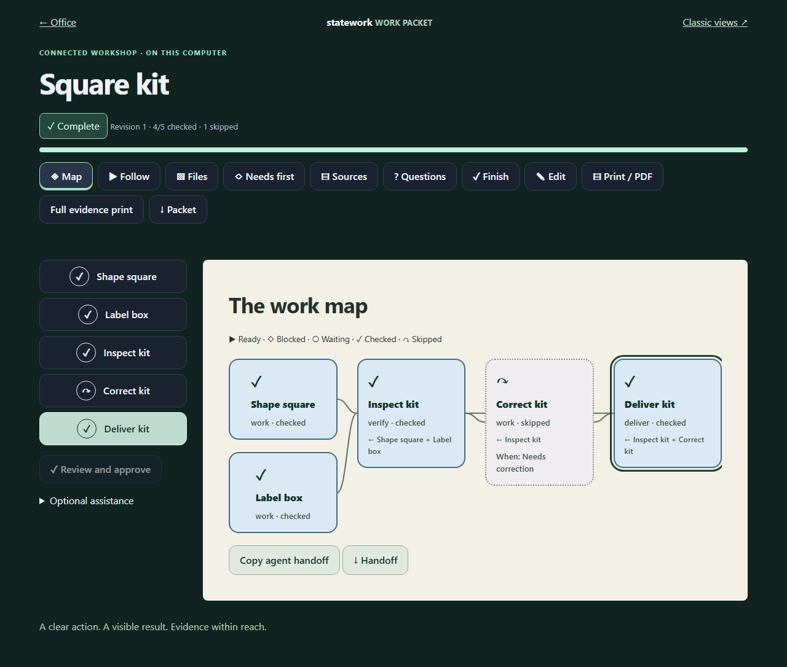

# Connected work

StateWork keeps the work definition, original inputs and result history together. A person, a newly connected agent and an integrated assistant use the same backend contracts. Previous chat memory is not required; authenticated access to StateWork and the necessary working applications is.



## Use the reference app

1. Open a task’s **Work packet**, choose **Edit → Enable connected work**, and define the intended result.
2. **Files** preserves original drawings, models, documents and result files. **Sources** captures their readable instructions and provenance. Saving a file extraction preserves its original file too. Extraction remains text only; inspect figures and other omitted content before checking coverage.
3. Give each action a short title, exact instruction, observable check and recovery path. Add **Reference** buttons for an original file, captured source or external destination, including its exact page, section or timestamp. Required external-only content blocks workers who choose StateWork files only.
4. Choose **Needs these earlier results**. No selection means independent work. Add a decision and label its observed alternatives; conditional actions name the decision and choice. Unknown edges and cycles are rejected. Preparation, work, verification and delivery are separate stages.
5. Put prerequisites on the actions that need them. Unassigned requirements apply to every action. Define only things needed before starting: a finished output is a result check, not its own prerequisite. Accounts, software and other manual requirements require a worker confirmation; another worker’s account confirmation is not inherited. A host can explicitly use workspace-scoped shared prerequisites.
6. Declare result files and their acceptance criteria. Choose the **successful finish** action or alternatives. A stopped branch or request for help can be recorded without counting as success.
7. Check input, procedure and acceptance coverage, record what was inspected, save and review. Review approves the procedure; it does not assert that every worker currently has the necessary access.
8. **Follow** opens one action. **Map** shows the real connections and states using symbols, words and colors. Use the reference buttons, confirm prerequisites after inspecting them, choose an observed decision, attach required results and record the check. **Next ready** skips waiting and inactive branches. Finish remains blocked until the selected path reaches a declared successful finish.

Undo removes the selected check and checks that depend on it, retaining independent results and the event history. Undo reopens a completed task. Revising the instructions resets review and checks; earlier revisions remain available.

Calendar suggestions and Next actions respect packet blockers: a reviewed, current packet needs at least one ready action or a successfully checked finish. An independently ready preparation step can proceed while a later delivery still needs access. Tasks without packets retain their task-link rules. Authenticated SDK observations and plans use the current worker and stored file availability. The snapshot-based Spatial view and its calendar check the file manifest but have no authenticated worker identity, so personal access stays unconfirmed there; open Follow for the current worker's exact readiness. Missing files and required external-only inputs do not count as available. Planning remains a projection, never a completion record.

Planning reports packet blockers with `reason: 'packet'` in `unplaced` or `scheduleIssues`. These are additional read-only result values; saved task statuses and snapshot schema versions are unchanged. Fixed appointments remain visible and consume their existing time even when their packet blocks execution.

The short print mode starts with the route or its current evidence blocker. **Full evidence print** includes captured text and provenance. Neither paper mode embeds binary CAD inputs or inherits website access; use the original files or a complete workspace bundle. Mobile places the current action first. The VR packet reads the same stages, blockers and references, and checks simple ready actions; **Open / Print** carries the selected step to the full view for decisions, attachments and written evidence. Physical headset qualification remains separate from browser XR emulation.

## A fresh worker connection

The versioned `statework.handoff` contains task and workspace IDs, revision, exact packet, execution graph, actor-specific readiness, actionable blockers, input/output manifests, capture identities and permitted recording operations. Essential references are loaded when needed rather than repeated throughout the screen. The protocol never grants external action permission.

```text
work_handoff → work_source / work_file → perform authorized action
             → execute_work(packet.check) → work_handoff
```

- SDK: `connection.handoff(workspaceId, taskId, environment)` and `client.handoff(...)`.
- HTTP: `POST /v1/workspaces/:id/instructions/:taskId/handoff` with `{externalAccess:false}` by default. The host computes actual file availability. A supplied `availableAssetIds` list can narrow that availability, never invent it.
- MCP: `work_handoff`, `work_source`, `work_files`, `work_file`, `work_attach_file`, and the existing `execute_work`. File reads return bounded 64 KiB ranges with a digest; clients can reassemble exact bytes. Attach small inputs/results up to 1 MiB through MCP; prefer HTTP or CLI for large files.
- CLI: `statework handoff <workspace> <task> [environment.json]`, `files`, `source`, `file-attach`, `file-export`, and `file-restore`. Exports refuse existing destinations.

Use [the connection guide](TOOLS.md) to configure a local client. The StateWork data directory must be an absolute path shared by the server and client. The normal filesystem-owner connection has local-owner authority; provision a token and membership for a restricted client. Tokens, browser sessions and other applications’ logins do not travel in handoffs or exports. The built-in **Copy agent handoff** includes saved context; it cannot install a connector in a fresh chat.

## Try complete fictional inputs

After building, run `node examples/connected-work.mjs connected-example.json`. Import the resulting file through **Files → Restore into new workspace** or `statework bundle-import`. The generator refuses to overwrite an existing destination and does not access your personal database.

The two examples contain an office handover specification and queue, and a CAD plate specification with its original dimensioned drawing. The office integration test creates and verifies its small fictional output using only imported StateWork data. The CAD test verifies available geometry, references and worker readiness; it does not operate CAD or claim to validate a finished solid. The conditional workshop browser fixture separately exercises parallel work, inspection, correction and delivery access.

## Files and portability

File metadata contains immutable ID, SHA-256, byte length, media type, source location, task association and host-attributed capture time/actor. Original bytes live in an optional transactional host-store capability, outside ordinary work snapshots and event JSON. The bundled Memory and SQLite stores implement that capability. Downloads check workspace access; SQLite verifies the digest before returning bytes and serves them as attachments, never executable page content.

`asset.register` records metadata; it does not assert that bytes exist. `connection.attach` and the HTTP upload route compute the digest and atomically commit bytes, metadata, event and retry receipt. Metadata-only imported maps report missing files. `restoreAsset` accepts only bytes that match an existing immutable identity. A replacement is a new asset with `replaces`; old identities remain in history and affected instructions require review.

**Files → Workspace + files** exports `statework.bundle`: a schema-1 snapshot, deduplicated original bytes and an explicit list of missing identities. Import verifies every included digest and accounts for every identity exactly once, then atomically creates a new workspace. Existing work is never overwritten. A plain snapshot and a packet export are lighter records; they are not complete file backups. Full SQLite backups also preserve every workspace, file, event, receipt and membership.

Limits are explicit: 128 MiB per stored file, a default 2 GiB of unique file bytes per workspace, 2,000 file identities, 100 actions and requirements, 100 outputs and 20 choices per decision. The local host can configure its workspace byte quota. Inline JSON bundles remain bounded at 64 MiB/file and 256 MiB total; the import route accepts up to 380 MiB including base64 overhead. Use [portable directory packages](DATA.md#larger-collections-portable-directory) for larger collections. They preserve exact originals and transfer one file at a time. Large organizational document stores still need an appropriate storage/hosting adapter and workload testing.

`connection.storageInfo(id)` and `GET /v1/workspaces/:id/storage` report unique stored bytes, aliases, missing identities and effective limits. `asset.archive` is a reversible, evidenced command: current packet references must be revised first, historical references and bytes survive, and archived assets disappear from current suggestions. Restore an archived asset before introducing it into a new packet. Archiving does not free its stored bytes or change task completion.

`asset.relink` changes a file's organizational `taskIds` with a recorded reason. It preserves its identity, original bytes, source locator and capture attribution. Historical checked outputs protect their task associations from removal. Use a shared course/project association for common references; file scope does not make optional reading a required action.

SQLite migration 2 adds the file table transactionally without changing existing work snapshots. Before upgrading an existing version-1 database, the adapter automatically creates a consistent adjacent `*.before-v2-<id>.sqlite` backup; a failed backup stops the upgrade. Keep the matching local token for rollback. Older binaries reject the newer database version. Legacy packets retain linear execution semantics; enabling connected work creates a new revision with the explicit execution contract.

## Organization and assistant integrations

The pure core has no model, network, filesystem or UI dependency. `WorkService` optionally accepts a trusted `WorkPolicy` as its third constructor argument. `beforeExecute` runs inside the serialized transaction before commands, attachment registrations and retries, and `beforeImport` runs before creating imported work. Hooks receive cloned data, must finish synchronously and may reject with `WorkError`. They can enforce designated reviewers, department policies or external approval requirements. Restoring matching immutable bytes does not change work records and uses the writer permission directly. Policy code is host configuration, never code loaded from a document, workspace extension or model proposal. The bundled loopback host remains a personal application; SSO and hosted collaboration require their own host and storage design.

```ts
const service = new WorkService(store, clock, {
  beforeExecute({ request, actor }) {
    if (request.commands.some(c => c.type === 'packet.review') && actor.role !== 'owner') {
      throw new WorkError('FORBIDDEN', 'This workspace requires its owner to review procedures.');
    }
  },
});
```

The optional local Codex adapter prepares a draft from supplied captures. It does not research private sites, see uncaptured images through a filename, approve work or operate applications. Its structured output is schema-validated; references are reconciled against real capture/work IDs. Unsupported citations and circular prerequisites become explicit unresolved questions or validation failures. Coverage always requires a reviewer. Source completeness and semantic correctness cannot be proved by matching quoted text.

External agents can research through their own authorized tools, capture evidence into StateWork and return proposed instructions. The in-app assistant and external workers share the same contract; either can be replaced. This makes work resumable without claiming autonomous completion of every occupation or knowledge of unstated requirements.

See [execution schema](../schemas/work-packet.schema.json), [worker handoff](../schemas/worker-handoff.schema.json), [portable bundle](../schemas/file-bundle.schema.json), [OpenAPI](../schemas/openapi.json), and the [release acceptance contract](connected-work-design.md).
