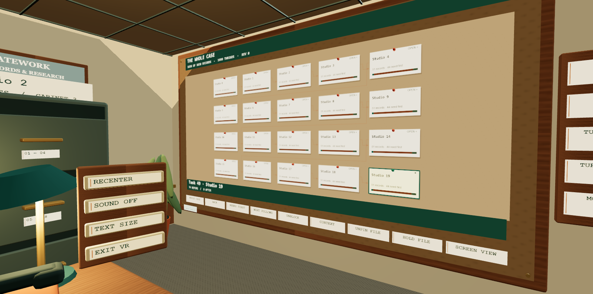

# The detective board

Open **Board on wall** in the office, or **Detective board** for the full-screen map. Both use the complete authorized workspace snapshot. Nothing is inferred from titles or notes, and looking around never changes a task.

## Follow the case

| Control | Result |
| --- | --- |
| **Whole case** | Reset search, scope and filters; show every record, including completed and archived work |
| Project / group card | Open its records; keep a breadcrumb and a way back |
| File card | Show its state, before/after counts, source, notes and direct requirements |
| **Needs first** | Follow all upstream prerequisites, including completed evidence |
| **What follows** | Follow all downstream dependents; parent and related links are optional context |
| **Unblock** | Rank available prerequisites by direct work opened, then wider unfinished reach |
| **Pin file** | Keep the file in one of twelve persistent memory slots |
| **Your trail / Back** | Revisit the previous investigation or return from a group |
| **Hold file** | Bring the selected record into the existing folder/key workflow |
| **Screen view** in VR | Leave the immersive session and open the accessible board |

Full-screen controls include search across titles, tags and descriptions, open/finished/archived filters, zoom, fit and pan. Arrow keys pan the focused map, +/− zoom and 0 fits. Drag empty space or use touch scrolling. **Files & groups** provides ordinary text buttons. Symbols, labels and stroke patterns reinforce colors.

The wall has the same investigation lenses, group drill-down, pins and file pickup. Its navigation panel offers desk/board stations, turns and movement pause. For dense work, open a group or use the larger screen view. Full file titles and sources remain available in the browser inspector and held-file clipboard.

## What the numbers mean

- **Records** includes tasks, projects, events and notes. It is not a task completion percentage.
- Every matching record belongs to exactly one card. At most 32 cards appear at once; larger groups open into smaller groups until every file is reachable. Status changes preserve positions within the same view.
- Solid arrows run **prerequisite → dependent work**. Dashed arrows are **parent → child**. Dotted related links have no direction. Incoming and outgoing ports are separate; routed lines stay in card gutters.
- Group connections combine real edges. Numbers on combined threads count edges; internal links remain in the group. Coverage and outside-connection counts explain what a narrowed view includes. The text controls expose each group's internal-link count.
- **Open now** is the number of direct unfinished dependents whose last missing prerequisite would be cleared by finishing this file. Other requirements may still block broader work.
- **Reach** counts distinct unfinished downstream records, once each even when paths converge. Completed records remain in the full requirements/impact views. A future scheduled start excludes a file from current leads; dates on the newly unblocked work may still delay its start.
- Archived leads are visibly labeled and sort after active records. Cancellation waives that prerequisite according to the backend's existing rules; it remains a cancelled record, never a claimed completion.

These are graph facts, not a critical-path schedule, workload estimate, assignment or an AI prediction. Use **Refresh work** to load changes from another view. Successful work actions refresh the shared state and board; the revision is visible.

## Remember without rewriting work

Pins, last selected file, investigation lens, group scope and a bounded trail are saved in this browser under `statework.case.<workspaceId>`. Search is cleared on reload so it cannot silently hide the remembered case. Switching workspaces restores that workspace's own memory. Removed records are discarded from remembered state; a removed investigation returns to the overview. Full pins never silently evict an older pin.

These are local view preferences, separate from database records and history. They are not synchronized to another device. The desk's four temporary physical file pins remain a separate placement aid. Work mutations still use the existing SDK, server permissions, prerequisite checks, versions and retry receipts. Readers can inspect and pin without acquiring write access.

## Move around

| Input | Action |
| --- | --- |
| WASD | Move relative to the direction you face |
| Q / E | Turn 45° left / right |
| Right mouse drag | Look around through full rotations |
| Left XR thumbstick | Move relative to headset facing |
| Right XR thumbstick | Snap-turn 45° once per deliberate tilt; release before another turn |
| One controller | Its stick moves; use the wall's turn buttons |
| Desk / Board stations | Move directly to a clear viewing position, including while free movement is paused |
| **Free move on/off** | Pause walking and stick turns; the preference persists |

Movement stops at walls and the major furniture footprints, including open drawer clearance. The movement model normalizes diagonals, uses substeps to prevent tunnelling, and permits sliding along obstacles. Typing, open dialogs, lost window focus, hidden pages and session exit stop desktop movement. XR session visibility loss and controller disconnection require a neutral stick before movement resumes. Tracked physical head movement is not constrained by virtual collision bounds.

No dragging, timed selection, speech or two-handed action is required to investigate. The application starts silent. Optional local interaction cues remain redundant with visual feedback.

## Extend it

| Module under `packages/reference/src/spatial` | Responsibility |
| --- | --- |
| `detective-model.ts` | Complete graph index, exact dependency reach, ranked leads, coverage, aggregation and memory transitions |
| `detective-drawing.ts` | Shared SVG/canvas coordinates, routing, symbols and card text |
| `detective-board.ts` / `detective.css` | Browser dialog, search, zoom, keyboard/touch controls and local memory |
| `detective-wall.ts` | Right-wall art, reusable textures and matching physical ray targets |
| `office-layout.ts` | Room zones, obstacles, viewing stations and pure movement/turn rules |
| `office-scene.ts` | Camera rig, WebXR-standard gamepad input and session lifecycle |

`OfficeLayout.zones` can contain adjoining rectangles; their union has no phantom wall at a shared doorway. Add corresponding geometry, obstacles and stations when building more rooms. Vertical travel, elevators, streamed rooms and a complete office floor are future implementations, not supplied features. `SpatialView.board` and `.movement` are optional so existing render adapters can adopt these independently.

The pure board model is tested with a 10,000-record chain and converging branches. A 1,020-record browser fixture exercises 20 project groups and 1,999 links. These are functional coverage checks, not an enterprise concurrency or headset frame-rate promise. [Acceptance evidence](ACCEPTANCE.md) records the final checks.

The existing local host remains personal-first. A company can build its authenticated host and presentation on the shared backend contracts; this change does not add hosted collaboration or device sync.

Design references: [Shneiderman's overview, zoom/filter and details approach](https://www.cs.umd.edu/~ben/about.html) and the [W3C XR standard gamepad mapping](https://www.w3.org/TR/webxr-gamepads-module-1/). Input uses the primary thumbstick axes 2/3. Tests use IWER; **physical headset comfort, readability and performance remain unverified**.
