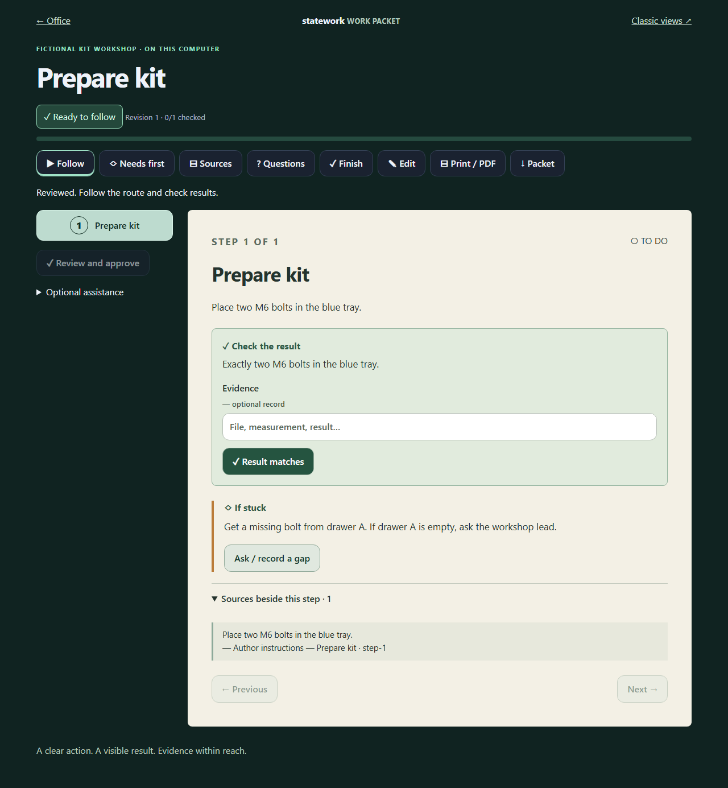

# Work packets: precise instructions with evidence

Open a task in the Office or Classic view and choose **Work packet / Print**. `/instructions/` also offers a task chooser. The numbered route shows one action, its expected result, recovery instructions and source excerpts. **Needs first**, **Questions**, **Sources** and **Finish** stay one click away. In the room, select **WORK PACKET** above the computer; page the paper card with either controller, check a result, or choose **OPEN / PRINT** to leave VR for the complete editor and print dialog.

## The manual workflow

1. **Sources:** capture existing task notes, paste a readable page/email, load a PDF/DOCX/text file, or explicitly capture a public URL. Preview before saving. Record the original URL, file or email reference. Mark complete only after checking the relevant contents. PDF extraction retains page numbers; scanned pages, figures, tables, layout and omitted sections need checking. Raw EML may contain encoded bodies and unread attachments.
2. **Edit:** define the finished result and final acceptance/delivery check. Give each action a short label, exact procedure, observable result, recovery instructions, optional minutes, direct link and requirements. Select a captured passage and cite its location. Original instructions can be captured under the local author's identity when saving; this is author provenance, not outside verification.
3. **Needs first:** describe accounts, software, people, materials, information and tasks. Include how to obtain and check each one. Linked prerequisites follow actual work status; other requirements need confirmation.
4. **Questions:** resolve missing facts, conflicts and coverage gaps. A link alone is unread. Partial sources need a coverage decision. Capture missing diagrams as readable descriptions/transcriptions where appropriate. Extracted text alone does not establish that a scan or illustrated procedure is complete.
5. **Save draft**, inspect the whole route, then **Review and approve**. Missing fields, unsupported citations, unanswered questions, unavailable prerequisites and changed context block review. The app records who reviewed which revision and when.
6. **Follow:** perform the action and choose **Result matches** after checking it. Optional evidence records file names or measurements. Checks run in order. Undo resets that and subsequent checks, preserves events and reopens completed work. Finish accepts the complete result; the ordinary Done action enforces the same packet gate.
7. **Print / PDF:** use browser print preview to print or save PDF. Requirements, procedures, checks, recovery, decisions and captured reference material travel together. Drafts are visibly labelled. No physical print job is submitted automatically. **Packet** exports a JSON bundle; **Finish** exports earlier revisions and checks.

No AI, account, network, speech, dragging or timed input is required. Typed drafts recover in the browser tab's session storage; explicit saves use SQLite. Import and generated proposals require inspection and review. Import resets review and completion; unknown work links become manual requirements. Earlier saved instructions remain in history. Sources can be included or removed from the working draft; removal clears its citations without deleting captures or saved records. Use **Check source coverage** to restore missing coverage questions. Long task notes remain in Sources/context and must be divided into precise actions.

## Optional Codex

Install the official [Codex CLI](https://learn.chatgpt.com/docs/codex/cli), then run `codex login` and `codex login status` on the same computer and OS account as StateWork. Compatible saved local sign-in is reused; StateWork does not read, copy or expose auth tokens. Codex supports [ChatGPT subscription and API-key sign-in](https://learn.chatgpt.com/docs/auth); limits and billing follow that local sign-in. An app-only session is not an embeddable model credential: complete CLI sign-in if needed.

Choose **Optional assistance → Draft with Codex** to explicitly send the selected task context and captured sources to the model service. The adapter uses documented [`codex exec` structured output](https://learn.chatgpt.com/docs/non-interactive-mode), an ephemeral working directory and read-only sandbox. It disables shell, app, plugin, browser, computer and multi-agent features, ignores user/project configuration, and returns a schema-validated draft. It cannot review instructions or execute work commands. StateWork bearer credentials and API-key environment overrides are not forwarded.

The built-in draft action does not research pages or inherit the desktop app's signed-in browser/connector session. **Copy research brief** and **Context bundle** provide a separate, schema-documented handoff to an assistant with authorized website/connector access. That assistant can gather missing evidence and return a `statework.packet` JSON bundle for inspection and import. Developers can also connect the StateWork MCP server. A company's connector controls its private content access; public capture cannot read localhost/private networks or use browser cookies. Research does not authorize sending messages, enrollment, purchases or submission.

Draft jobs return immediately. Polling reports progress; Cancel stops the local process tree on Windows. Runs have a five-minute limit. Failures, account limits and cancellation preserve manual work. **Inspect Codex draft** keeps a restorable previous working draft. Reconcile source/task changes before saving an older proposal. Jobs are private to their initiating actor, expire after 30 minutes and do not survive server restart. The host retains at most 32 jobs, evicting the oldest finished proposals first.

| Host setting | Meaning |
| --- | --- |
| `STATEWORK_CODEX=0` | Disable the adapter; manual authoring still works. |
| `STATEWORK_CODEX_BIN` | Exact executable or JavaScript CLI entry. Default discovery uses PATH and an existing npm CLI installation. No shell command string is accepted. |
| `STATEWORK_CODEX_MODEL` | Optional model available to the local Codex account. Otherwise the isolated CLI uses its built-in default, not the ignored user configuration. |
| `createServer({packetAssistant})` | Inject another trusted `PacketAssistant`. The personal host supplies Codex; test hosts never invoke paid models. |

## Backend contract

`WorkState.instructions` is an optional additive container with `sources` and `packets`. Existing schema-1 snapshots remain valid. Sources are immutable captures; a new capture can replace the latest capture in a chain while retaining earlier evidence. Packet content is immutable per revision, with separately recorded review and result checks. Events preserve the complete command history. Use current SDKs for snapshots containing instructions; older SDKs may reject the new optional field.

Core exports `packetContext`, `blankPacket`, `latestPacket`, `packetIssues`, `packetCompleteCommand` and all domain types. Semantic observations include packet identity, readiness, checked/total steps and the completion gate reason. SDK connections and `WorkClient` expose `instructions(workspaceId, taskId)`. CLI: `statework instructions <workspace-id> <task-id>`. MCP: `work_instructions`, with writes through `execute_work`.

| Command | Semantics |
| --- | --- |
| `source.capture {source}` | Untrusted text, task associations, locator, kind, coverage and optional `replaces`. Host supplies time and actor. |
| `packet.save {packet, expectedPacketId}` | New revision against exact current context and previous packet ID; resets review/checks. |
| `packet.review {id}` | Recompute readiness, then record host time/actor if gaps are resolved. |
| `packet.check {id, stepId, checked, evidence}` | Check an ordered result, or undo it and later checks. |

Commands retain role checks, workspace revisions, atomic commits, receipts and exact retries. Direct Done transitions require the latest packet to be reviewed with all results checked. Task content, relevant requirements and current source captures can make a review stale. Focus-task status and planning-minute logs do not. Context keys are deterministic change detectors, not cryptographic proofs. Revisions never carry result checks forward automatically.

Citations must match captured text exactly and include a location. This establishes textual provenance, not truth or full semantic entailment. Human review checks whether evidence supports the procedure, settings, decisions and acceptance criteria. Unknown real-world requirements, inaccurate documents and later website changes cannot be guaranteed away. StateWork exposes known gaps and preserves what was reviewed; it does not monitor external sources automatically.

See [packet schema](../schemas/work-packet.schema.json), [capture schema](../schemas/source-capture.schema.json), [OpenAPI](../schemas/openapi.json), and [headless example](../examples/work-packets.mjs). REST covers context, briefs, assistant availability, draft start/status/cancel and explicit source extraction. Extract/fetch returns a preview; `source.capture` is the durable write.

Explicit limits: 100 actions/requirements per packet; 200 questions; 2,000 source captures and 2,000 packet revisions per workspace; 180,000 characters per source; 12,000 per instruction field or quotation; 8 MiB file, 250 PDF pages, 30 seconds per extraction. Assistant context is limited to 1 MB, output to 900,000 characters and active jobs to four per host/one per actor. Normal commands retain the 1 MB / 100-command limits. Snapshot files up to 16 MiB can be imported in the browser (20 MiB request limit); the CLI supports larger snapshots. No silent source truncation occurs: split large tasks into focused tasks. The snapshot-backed personal host is not a distributed company document store. Adapters can add richer ingestion, image-aware sources, certified procedures and organizational approvals around these contracts.
